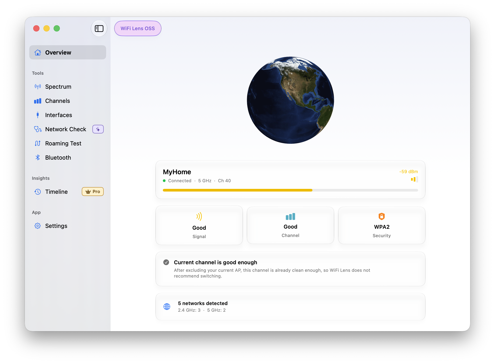

# WiFi Lens

**Eine native Open-Source-Netzwerkdiagnose-App für macOS mit integrierter Wi-Fi-Analyse.**

Verbindungsprobleme diagnostizieren, Wi-Fi-Kanalauslastung analysieren und Roaming-Verhalten validieren — die Ergebnisse werden lokal auf deinem Mac verarbeitet.

[](https://github.com/SHIINASAMA/wifi-lens/releases/latest)
[](https://github.com/SHIINASAMA/wifi-lens/releases/latest)
[](LICENSE)
[](https://github.com/SHIINASAMA/wifi-lens/actions?query=workflow%3A%22Swift+CI%22)

<p align="center">
  <a href="https://github.com/SHIINASAMA/wifi-lens/releases/latest"><strong>Open-Source-Edition herunterladen</strong></a>
  ·
  <a href="https://apps.apple.com/app/wifi-lens-pro/id6776590746"><strong>WiFi Lens Pro holen</strong></a>
  ·
  <a href="https://wifi-lens.shiinalabs.com">Offizielle Website</a>
</p>

macOS 14+ · Intel & Apple Silicon · Keine Telemetrie



## Open Source oder Pro?

| Open-Source-Edition | WiFi Lens Pro |
|---|---|
| Kostenlos und Open Source — [GitHub Releases](https://github.com/SHIINASAMA/wifi-lens/releases/latest) | Einmalige kostenpflichtige Mac App Store-Edition — [Mac App Store](https://apps.apple.com/app/wifi-lens-pro/id6776590746) |
| Tri-Band-Wi-Fi-Scan und Spektrumanalyse | Professionelle Monitoring-Workflows auf derselben Kernanalyse-Engine |
| Kanalqualität, Netzwerkdetails, Roaming-Tests | Spektrum-Sitzungsaufzeichnung — Aufnahme und Wiedergabe über Zeit |
| Netzwerk-Selbsttest, BLE-Scanner, MCP-Server | Zusätzliche professionelle Workflows |
| PNG/CSV exportieren · Sparkle-Updates | Dauerhafte Menüleiste · Ereignis-Zeitachse · Mac App Store-Updates |

> Beide Editionen teilen sich dieselben Wi-Fi-Kernanalyse-Fähigkeiten. Pro ergänzt Spektrumsaufzeichnung, dauerhafte Menüleiste und Ereignis-Zeitachse für professionelle Workflows.

🇺🇸 [English](README.md) | 🇩🇪 [Deutsch](README.de.md) | 🇪🇸 [Español](README.es-ES.md) | 🇫🇷 [Français](README.fr.md) | 🇨🇳 [简体中文](README.zh-Hans.md) | 🇯🇵 [日本語](README.ja.md)

---

## Über WiFi Lens

WiFi Lens ist eine native macOS-Netzwerkdiagnose-App, entwickelt mit SwiftUI, CoreWLAN und CoreBluetooth. Sie hilft dir, Verbindungsprobleme durch Netzwerk-Selbsttests, Wi-Fi-Scans, Analyse der Kanalauslastung und Roaming-Validierung zu beheben. Der integrierte BLE-Scanner bietet zusätzliche Einblicke in nahegelegene drahtlose Geräte.

Dieses Repository enthält die kostenlose Open-Source-Edition. WiFi Lens Pro ist eine separate kostenpflichtige Edition, die Spektrumsaufzeichnung, dauerhafte Menüleiste und Ereignis-Zeitachse ergänzt.

**Typische Anwendungsfälle:**

- 🏠 **Heimnetzwerk optimieren:** Finde überlastete Kanäle und stelle deinen Router auf einen ruhigeren Kanal um.
- 🏢 **Büro-Wi-Fi prüfen:** Scanne die Bänder 2,4, 5 und 6 GHz, um Funklöcher oder falsch konfigurierte APs zu finden.
- 🚶 **Roaming validieren:** Zeichne AP-Wechsel auf einem Zeitdiagramm auf, während du dich durch ein Gebäude bewegst.
- 🎧 **BLE-Geräte untersuchen:** Verfolge RSSI-Verläufe von Bluetooth-Peripheriegeräten und erkenne Reichweiten- oder Interferenzprobleme.

---

## Funktionen

| Kategorie | Fähigkeit | Edition |
|----------|-----------|---------|
| 📡 **Wi-Fi-Scanning** | Echtzeit-Scan über die Bänder 2,4, 5 und 6 GHz mit Signalstärke pro Netzwerk | OSS & Pro |
| 📊 **Spektrum-Ansicht** | Gauß-Glockenkurven-Diagramme zeigen Kanalbelegung auf einen Blick | OSS & Pro |
| 🎯 **Kanalqualität** | Auslastungsbewertungen mit regulatorisch passenden Empfehlungen für deine Region | OSS & Pro |
| 🔍 **Netzwerkdetails** | PHY-Generation, Kanalbreite, 802.11k/r/v-Roaming, WPA3, versteckte SSIDs | OSS & Pro |
| 📶 **Verbindungsinformationen** | IP, Gateway, DNS, MAC, Kanal, Tx-Rate und Sicherheitszusammenfassung | OSS & Pro |
| 🩺 **Netzwerk-Selbsttest** | Ein-Klick-Verbindungsdiagnose — Pfad, DNS, HTTPS und Proxy-Erreichbarkeit mit evidenzbasierten Schlussfolgerungen | OSS & Pro |
| 📈 **Ereignis-Zeitachse** | Verbindungsereignis-Verlauf — Roaming, Kanalwechsel, Verbindungsabbrüche und Signalabfälle | Nur Pro |
| 📊 **Statistiken** | Analysiere deinen lokalen Timeline-Verlauf mit Zeitauswahl und Vergleich | Nur Pro |
| 💡 **Erkenntnisse** | Erhalte nachvollziehbare Erkenntnisse aus deinem Timeline-Verlauf | Nur Pro |
| 🔄 **Roaming-Test** | Überwachung von AP-Wechseln mit Zeitdiagramm, Bereichsauswahl sowie Speichern und Laden von Sitzungen | OSS & Pro |
| 🗺️ **Kanal-Heatmap** | Belegungsübersicht pro Band zur schnellen Erkennung von Überlastungsmustern | OSS & Pro |
| 🎬 **Spektrum-Aufzeichnung** | Spektrumsänderungen über Zeit aufnehmen und wiedergeben | Nur Pro |
| 🎧 **BLE-Scanner** | Bluetooth LE-Geräte-Erkennung, RSSI-Analyse, Trend-Diagramme und Gerätetracking | OSS & Pro |
| 🎨 **Intelligente Farbgebung** | Deterministische Farbzuordnung anhand der SSID; dasselbe Netzwerk behält dieselbe Farbe | OSS & Pro |
| 📍 **Menüleiste** | Lebt in deiner Menüleiste — klicke das Symbol, um den Analysator jederzeit zu öffnen | Nur Pro |
| 🔒 **Privatsphäre zuerst** | Keine Telemetrie oder Nutzungsanalyse; Wi-Fi-Scandaten bleiben auf deinem Mac | OSS & Pro |
| 🌐 **MCP-Server** | Eingebettete HTTP-API auf `127.0.0.1:19840` für externe Tools | OSS & Pro |
| 🔄 **Auto-Updates** | Sparkle-Updates in der GitHub-Edition; Mac App Store-Updates in Pro | OSS & Pro |
| 📤 **Exportieren** | Speichere Band-Diagramme als PNG-Bilder oder CSV-Daten | OSS & Pro |
| 🌍 **Lokalisiert** | Englisch, Deutsch, Spanisch, Japanisch und vereinfachtes Chinesisch | OSS & Pro |

Alle Funktionen sind in der Open-Source-Edition enthalten, sofern nicht **Nur Pro** markiert. Pro umfasst jede Open-Source-Funktion plus Aufzeichnungs-, Menüleisten-, Ereignis-Zeitachsen-, Statistik- und Erkenntniswerkzeuge.

---

## Design

**Native macOS-Oberfläche.** CoreWLAN kommuniziert direkt mit der Wi-Fi-Hardware. SwiftUI stellt native Mac-Steuerelemente und Fensterverhalten bereit.

**Empfehlungen mit regulatorischem Kontext.** WiFi Lens ermittelt die Regulierungsregion anhand der Systemregion, der Hardwarefähigkeiten und der Ländercodes naher APs. Die App filtert Empfehlungen nach DFS-, Indoor- und 6-GHz-AFC-Vorgaben.

**Verknüpfte Ansichten.** Wähle ein Netzwerk in der Tabelle aus, um es in jedem Diagramm hervorzuheben. Bewege den Mauszeiger über eine Glockenkurve, um die SSID zu sehen.

**Werkzeuge der Open-Source-Edition.** Exportiere PNG- und CSV-Dateien oder speichere und lade Roaming-Sitzungen. Der lokale MCP-Server verbindet WiFi Lens mit deinen eigenen Tools.

---

## Download

Erfordert **macOS 14 (Sonoma) oder später**. Funktioniert auf Intel und Apple Silicon Macs. Das Scannen des 6-GHz-Bands erfordert Wi-Fi 6E/7-Hardware.

- **Open-Source-Edition** — [GitHub Releases](https://github.com/SHIINASAMA/wifi-lens/releases/latest) (kostenlos, mit optionalen Sparkle-Auto-Updates)
- **WiFi Lens Pro** — [Mac App Store](https://apps.apple.com/app/wifi-lens-pro/id6776590746) (unterstützte Regionen)

> [!IMPORTANT]
> Unter macOS 14+ müssen die **Ortungsdienste** aktiviert sein, damit die App Wi-Fi-SSID-Namen lesen kann.
> Öffne **Systemeinstellungen → Datenschutz & Sicherheit → Ortungsdienste** und aktiviere WiFi Lens, wenn du dazu aufgefordert wirst.

> 🌐 **Offizielle Website:** [wifi-lens.shiinalabs.com](https://wifi-lens.shiinalabs.com) bietet Screenshots, eine Funktionsübersicht, KI/MCP-Workflows und häufige Fragen.

## Privatsphäre

WiFi Lens erfasst keine Nutzungsanalysen, Absturztelemetrie oder Wi-Fi-Scandaten.

- **Ortungsdienste:** macOS benötigt diese Berechtigung, um Wi-Fi-SSID-Namen bereitzustellen. WiFi Lens liest deine GPS-Position nicht aus.
- **Regionserkennung:** WiFi Lens nutzt die Systemregion, die von der Hardware gemeldete Kanalliste und Ländercodes naher APs auf dem Gerät.
- **Netzwerk-Selbsttest:** Wenn du ihn startest, löst WiFi Lens öffentliche Endpunkte (`www.apple.com`, `www.microsoft.com`, `www.msftconnecttest.com`) auf und kann die Erreichbarkeit deiner konfigurierten Proxy-Endpunkte prüfen.
- **MCP-Server:** Der optionale Server bindet sich an `127.0.0.1`. Lokale Tools erhalten erst nach deiner Aktivierung Zugriff auf Scandaten.
- **Updateprüfungen:** Die GitHub-Edition kontaktiert GitHub, wenn du eine Updateprüfung startest oder automatische Prüfungen aktivierst.

---

## Entwickeln

```sh
git clone https://github.com/SHIINASAMA/wifi-lens
cd wifi-lens
git submodule update --init ChartLens
cd WiFiLens

# Builden
xcodebuild -project WiFiLens.xcodeproj -scheme "WiFi Lens" -configuration Debug -destination 'platform=macOS' build

# Tests ausführen
xcodebuild -project WiFiLens.xcodeproj -scheme "WiFi Lens" -configuration Debug -destination 'platform=macOS' -skipPackageUpdates test -only-testing:WiFiLensTests

# In Xcode öffnen
xed WiFiLens.xcodeproj
```

Der Produktname ist `WiFi Lens.app` (mit Leerzeichen).

Dokumente zu Architektur, Tests und Roadmap liegen unter [docs/](docs/).

---

## Mitwirken

Fehlerberichte und Funktionsvorschläge sind willkommen. Öffne ein [Issue](https://github.com/SHIINASAMA/wifi-lens/issues) oder starte eine [Diskussion](https://github.com/SHIINASAMA/wifi-lens/discussions).

Siehe [Beitrichtsrichtlinien](.github/CONTRIBUTING.md) für Entwicklungseinrichtung, Pull-Request-Konventionen und Lokalisierungsanforderungen. Wenn du Coding-Agenten verwendest, beachte auch die Hinweise in [.agents/references/collaboration-rules.md](.agents/references/collaboration-rules.md).

Der Maintainer kann erhebliche Beiträge zu WiFi Lens mit einem von Apple ausgestellten Promo-Code für WiFi Lens Pro anerkennen. Siehe [Mitwirkenden-Anerkennung](.github/CONTRIBUTING.md#contributor-recognition) für Details.

**Kontakt:** [@WiFiLens auf X](https://x.com/WiFiLens) · [wifi-lens@shiinalabs.com](mailto:wifi-lens@shiinalabs.com)

---

## Danksagungen

Dieses Projekt basiert auf [tiny-wifi-analyzer](https://github.com/nolze/tiny-wifi-analyzer) von [nolze](https://github.com/nolze), dem Entwickler des ursprünglichen Python-basierten Wi-Fi-Scanners. Seitdem wurde die App vollständig mit Swift, SwiftUI und CoreWLAN neu geschrieben und zu einer nativen macOS-Anwendung weiterentwickelt.

---

## Lizenz

Apache License 2.0 © 2020 nolze, 2026 SHIINASAMA. Siehe [LICENSE](LICENSE) für vollständigen Text.
