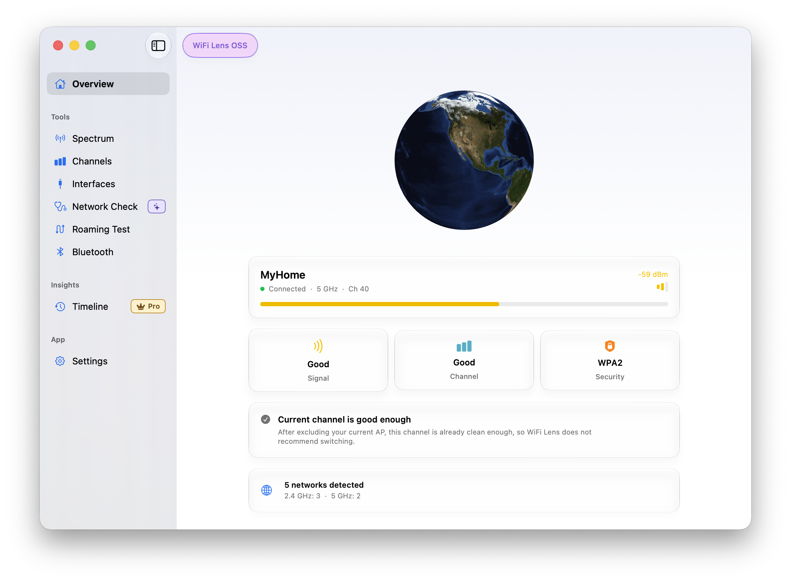

# WiFi Lens

[](https://github.com/SHIINASAMA/wifi-lens/actions?query=workflow%3A%22Build+%26+Release%22)
[](https://x.com/WiFiLens)
[](mailto:wifi-lens@outlook.com)

Simple, open-source Wi-Fi channel and signal strength analyzer for macOS.
Built with SwiftUI, CoreWLAN, CoreBluetooth, and Sparkle.



🇺🇸 [English](README.md) | 🇨🇳 [简体中文](README.zh-Hans.md) | 🇯🇵 [日本語](README.ja.md)

## Features

- Real-time Wi-Fi scanning across 2.4 GHz, 5 GHz, and 6 GHz bands
- BLE device scanner with RSSI analysis, trend charts, and device tracking
- Gaussian bell-curve charts per band with dynamic y-axis scaling
- Per-band freeze and drag-to-zoom
- Deterministic SSID-based color assignment
- Combined network table with native column sort, row selection, and chart highlighting
- Filter networks by SSID or BSSID across all bands
- 802.11 capability details: PHY generation, channel width, 802.11k/r/v roaming, WPA3, hidden SSID
- Connected network status: IP, gateway, DNS, MAC, channel, Tx rate, security
- Connection quality score with channel congestion analysis
- Regulatory-aware channel recommendations based on region inference
- Signal history trend charts per network
- Roaming test: AP transition monitoring with timeline chart, range selector, and session save/load
- Channel occupancy heatmap per band
- Configurable scan interval (1–10 seconds)
- Export per-band charts as PNG or CSV
- MCP (Model Context Protocol) HTTP server for external tool integration
- Built-in Sparkle auto-update support
- Crash reporting and structured logging
- Localized in English, Japanese, and Simplified Chinese

## Requirements

- macOS 14.0 (Sonoma) or later

> [!IMPORTANT]
> On macOS 14+, Location Services permission is required to read Wi-Fi SSIDs.
> Open **System Settings → Privacy & Security → Location Services** and enable
> the app when prompted.

## Privacy

WiFi Lens does not collect, store, or transmit any personal information, usage analytics, or telemetry. All data stays on your Mac.

- **Location Services** — Required by macOS to expose Wi-Fi SSID names. WiFi Lens never accesses your GPS coordinates.
- **Region detection** — Channel recommendations use your system locale, hardware-reported channel list, and nearby AP country codes to infer your regulatory domain. This inference runs entirely on-device.
- **MCP server** — Bound to `127.0.0.1`. No scan data leaves your machine unless you explicitly route it elsewhere.

## Download

[Visit the latest release](https://github.com/SHIINASAMA/wifi-lens/releases/latest/)

### Gatekeeper workaround

Because the application is not signed, macOS Gatekeeper may block it.

- **Right-click** the app icon → **Open** → confirm in the dialog; or
- Run in Terminal:
  ```sh
  xattr -d com.apple.quarantine /Applications/WiFi\ Lens.app
  ```

## Develop

```sh
git clone https://github.com/SHIINASAMA/wifi-lens
cd wifi-lens/WiFiLens

# Build
xcodebuild -project WiFiLens.xcodeproj -scheme "WiFi Lens" -configuration Debug -destination 'platform=macOS' build

# Run tests
xcodebuild -project WiFiLens.xcodeproj -scheme "WiFi Lens" -configuration Debug -destination 'platform=macOS' test

# Open in Xcode
xed WiFiLens.xcodeproj
```

The product name is `WiFi Lens.app` (with space).

### Website

The landing page is built with Vite and Tailwind CSS, outputting to `_site/`.

```sh
cd wifi-lens          # repo root
npm ci
npm run dev           # dev server at localhost:5173/wifi-lens/
npm run build         # production build
npm run preview       # preview production build
```

For documentation on architecture, roadmap, and known issues, see the [docs/](docs/) directory.

## Acknowledgments

This project began as a fork of [tiny-wifi-analyzer](https://github.com/nolze/tiny-wifi-analyzer) by [nolze](https://github.com/nolze), who built the original Python-based Wi-Fi scanner. Since then the app has been fully rewritten in Swift with SwiftUI and CoreWLAN, evolving into a native macOS application under a new name.

## License

```
Copyright 2020 nolze
Copyright 2026 SHIINASAMA

Licensed under the Apache License, Version 2.0 (the "License");
you may not use this file except in compliance with the License.
You may obtain a copy of the License at

   http://www.apache.org/licenses/LICENSE-2.0

Unless required by applicable law or agreed to in writing, software
distributed under the License is distributed on an "AS IS" BASIS,
WITHOUT WARRANTIES OR CONDITIONS OF ANY KIND, either express or implied.
See the License for the specific language governing permissions and
limitations under the License.
```
