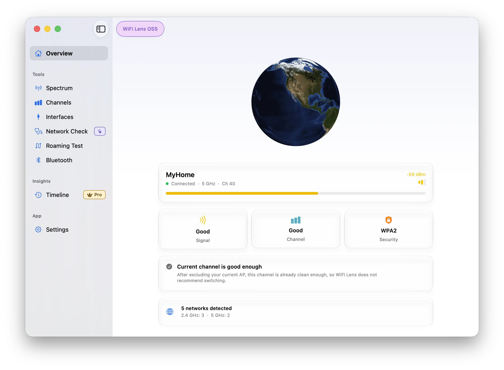
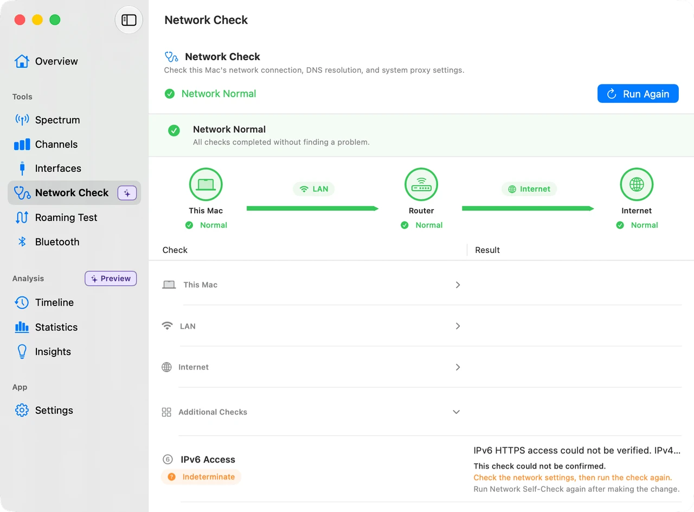
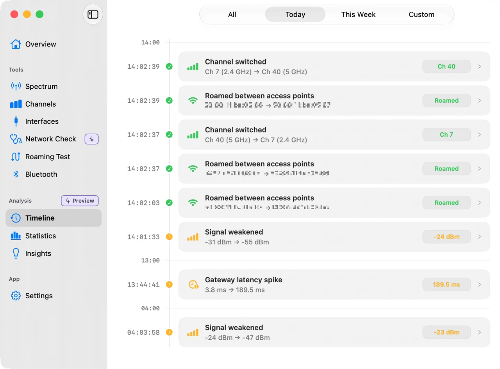

# WiFi Lens

**原生开源 macOS 网络诊断工具，内置 Wi-Fi 分析。**

诊断连接问题、分析 Wi-Fi 信道拥堵、验证漫游行为——所有结果都在本地处理。

[](https://github.com/SHIINASAMA/wifi-lens/releases/latest)
[](https://github.com/SHIINASAMA/wifi-lens/releases/latest)
[](LICENSE)
[](https://github.com/SHIINASAMA/wifi-lens/actions?query=workflow%3A%22Swift+CI%22)

<p align="center"></p>

<p align="center">
  <a href="https://github.com/SHIINASAMA/wifi-lens/releases/latest"><strong>下载开源版</strong></a>
  &nbsp;·&nbsp;
  <a href="https://apps.apple.com/app/wifi-lens-pro/id6776590746"><strong>获取 WiFi Lens Pro</strong></a>
  &nbsp;·&nbsp;
  <a href="https://wifi-lens.shiinalabs.com">官方网站</a>
</p>

<p align="center">macOS 14+ &nbsp;·&nbsp; Intel &amp; Apple Silicon &nbsp;·&nbsp; 无遥测</p>

<p align="center">
  🔒 <strong>本地优先隐私</strong> — 无账号、无云端、无遥测<br>
  🩺 <strong>基于证据的诊断</strong> — 路径、DNS、HTTPS 与代理可达性检查<br>
  🤖 <strong>AI 工作流 MCP 集成</strong> — 连接 Claude Desktop 读取实时 Wi-Fi 数据
</p>

---

<p align="center">
  <a href="README.md">🇺🇸 English</a> · <a href="README.de.md">🇩🇪 Deutsch</a> · <a href="README.es-ES.md">🇪🇸 Español</a> · <a href="README.fr.md">🇫🇷 Français</a> · 🇨🇳 简体中文 · <a href="README.ja.md">🇯🇵 日本語</a>
</p>
<p align="center">
  <a href="#功能">功能</a> · <a href="#版本">版本</a> · <a href="#ai--mcp-集成">AI / MCP</a> · <a href="#隐私">隐私</a> · <a href="#安装">安装</a> · <a href="#开发">开发</a> · <a href="#贡献">贡献</a> · <a href="#许可">许可</a>
</p>

---

## 功能

### 核心 · OSS & Pro

| 功能 | 说明 | 状态 |
|------|------|------|
| 📡 Wi-Fi 扫描 | 跨 2.4 / 5 / 6 GHz 频段的实时扫描 | 稳定 |
| 📊 频谱视图 | 高斯曲线图展示信道占用 | 稳定 |
| 🎯 信道质量 | 拥堵评分与区域推荐 | 稳定 |
| 🔍 网络详情 | PHY 代际、信道宽度、802.11k/r/v、WPA3 | 稳定 |
| 📶 连接信息 | IP、网关、DNS、MAC、发送速率和安全摘要 | 稳定 |
| 🚶 漫游测试 | AP 切换监控与会话管理 | 稳定 |
| 🗺️ 信道热力图 | 各频段占用热力图 | 稳定 |
| 🎧 BLE 扫描器 | Bluetooth LE 设备发现、RSSI 分析和追踪 | 稳定 |
| 🎨 智能着色 | 基于 SSID 的确定性颜色分配 | 稳定 |
| 🌐 MCP 服务器 | 内嵌 HTTP API，支持 AI 工具集成 | 稳定 |
| 📤 导出 | 保存图表为 PNG 或 CSV | 稳定 |
| 🔒 隐私优先 | 无遥测；扫描数据保留在本地 | 稳定 |
| ⬆️ 自动更新 | Sparkle（GitHub）或 Mac App Store | 稳定 |
| 🌍 本地化 | 英语、德语、西班牙语、日语、中文 | 稳定 |
| 🩺 网络自检 | 一键诊断路径、DNS、HTTPS 与代理 | 预览 |
| 📻 AP 雷达 | 追踪选定接入点并随信号强度发出音频脉冲反馈 | 预览 |

### Pro 独占

| 功能 | 说明 | 状态 |
|------|------|------|
| 📈 事件时间线 | 连接事件历史——漫游、断连与信号变化 | 预览 |
| 📋 统计 | 分析 Timeline 历史数据，支持时段对比 | 预览 |
| 💡 洞察 | 可解释的发现，链接到证据 | 预览 |
| 🎬 频谱录制 | 随时间捕获并回放频谱变化 | 稳定 |
| 📱 菜单栏 | 从 macOS 菜单栏快速访问 | 稳定 |

---

## 版本

| | 开源版 | WiFi Lens Pro |
|--|-------|--------------|
| 价格 | 免费 | 一次性购买 |
| 来源 | [GitHub Releases](https://github.com/SHIINASAMA/wifi-lens/releases/latest) | [Mac App Store](https://apps.apple.com/app/wifi-lens-pro/id6776590746) |
| 核心分析 | ✅ 以上全部功能 | ✅ 包含开源版全部功能 |
| 独有工具 | — | 时间线 · 统计 · 洞察 · 录制 · 菜单栏 |
| 更新 | Sparkle 自动更新 | Mac App Store |

> 两个版本共享同一分析引擎。Pro 在此基础上增加专业监控工作流。

---

## AI / MCP 集成

WiFi Lens 内置 MCP 服务器，AI 助手可读取本地 Wi-Fi 数据。在设置中启用后，添加到 Claude Desktop：

```json
{
  "mcpServers": {
    "wifi-lens": {
      "url": "http://127.0.0.1:19840"
    }
  }
}
```

连接后可以问 Claude：*"附近哪些信道比较拥堵？"* 或 *"我的网关可达吗？"*。服务器仅绑定 `127.0.0.1`——除非主动路由，数据不会离开你的电脑。

更多示例请参考 [AI 工作流指南](https://wifi-lens.shiinalabs.com/ai-mcp/)。

---

<table>
<tr>
<td width="50%" align="center"><sub>网络自检</sub></td>
<td width="50%" align="center"><sub>事件时间线（Pro）</sub></td>
</tr>
</table>

---

## 隐私

WiFi Lens 不收集使用分析、崩溃遥测或 Wi-Fi 扫描数据。

- **定位服务：** macOS 需要此权限才能读取 Wi-Fi SSID 名称。WiFi Lens 不读取 GPS 位置。
- **区域检测：** 使用系统语言设置、硬件上报的信道列表和附近 AP 的国家代码，均在设备上完成。
- **网络自检：** 解析公共端点（`www.apple.com`、`www.msftconnecttest.com`），可能测试已配置代理端点的可达性。
- **MCP 服务器：** 仅绑定 `127.0.0.1`。启用后本地工具方可访问数据。
- **更新检查：** GitHub 版在检查更新时联系 GitHub。

📋 [安全策略](SECURITY.md) · 📝 [更新日志](https://github.com/SHIINASAMA/wifi-lens/releases) · ❓ [常见问题](https://wifi-lens.shiinalabs.com/faq/) · 🌐 [完整隐私政策](https://wifi-lens.shiinalabs.com/privacy/)

---

## 安装

需要 **macOS 14 (Sonoma) 或更高版本**。支持 Intel 和 Apple Silicon Mac。6 GHz 扫描需要 Wi-Fi 6E/7 硬件。

- **开源版** — [GitHub Releases](https://github.com/SHIINASAMA/wifi-lens/releases/latest)（免费，Sparkle 自动更新）
- **WiFi Lens Pro** — [Mac App Store](https://apps.apple.com/app/wifi-lens-pro/id6776590746)

> [!IMPORTANT]
> macOS 14+ 需要**定位服务**才能读取 Wi-Fi SSID 名称。前往 **系统设置 → 隐私与安全性 → 定位服务** 允许 WiFi Lens。

---

## 开发

```sh
git clone https://github.com/SHIINASAMA/wifi-lens
cd wifi-lens
git submodule update --init ChartLens
cd WiFiLens

xcodebuild -project WiFiLens.xcodeproj -scheme "WiFi Lens" \
  -configuration Debug -destination 'platform=macOS' build
```

架构文档见 [docs/](docs/)。

---

## 贡献

欢迎提交 Bug 报告和功能建议。请参阅[贡献指南](.github/CONTRIBUTING.md)了解环境和规范。重大贡献者可能获得 Pro 兑换码——参见[贡献者认可](.github/CONTRIBUTING.md#contributor-recognition)。

**联系方式：** [@WiFiLens on X](https://x.com/WiFiLens) · [wifi-lens@shiinalabs.com](mailto:wifi-lens@shiinalabs.com)

---

Forked from [tiny-wifi-analyzer](https://github.com/nolze/tiny-wifi-analyzer)。MAC 厂商数据来自 [IEEE Registration Authority](https://standards.ieee.org/products-programs/regauth/)——详见[第三方声明](docs/THIRD-PARTY-NOTICES.md)。

Apache License 2.0 © 2020 nolze, 2026 SHIINASAMA — 详见 [LICENSE](LICENSE)。
