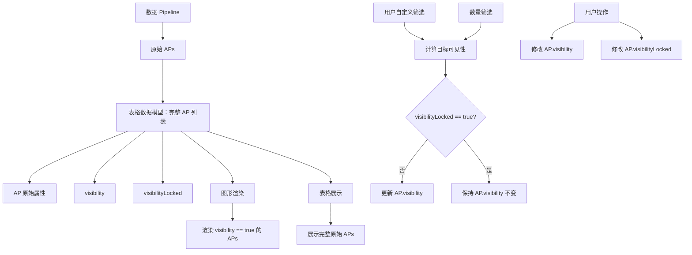

# AP Focus State Design Spec

## Overview

重构 AP 筛选与图形渲染逻辑。原始 APs 完整进入表格，筛选器只修改未锁定 AP 的 visibility，锁定保护 visibility 不被自动逻辑修改，图形渲染只读取 visibility。

## 数据链路



## 核心规则

1. **原始 APs** 来自数据 Pipeline，不被筛选器直接裁剪，完整进入表格数据模型
2. **表格数据模型** 为每个 AP 维护 `visibility` 和 `visibilityLocked` 状态
3. **筛选器、数量筛选** 根据规则动态计算目标可见性，尝试更新 `AP.visibility`
4. **锁定保护**：`visibilityLocked == true` 的 AP，筛选器不能修改其 `visibility`
5. **用户操作** 拥有最高优先级，可修改 `visibility` 和 `visibilityLocked`
6. **图形渲染** 只渲染 `visibility == true` 的 AP
7. **表格展示** 完整原始 APs，不受 `visibility` 影响

## 重要概念

- **锁定** = 锁定当前可见性状态，不是强制可见
- 用户可以把 AP 锁定为始终可见，也可以锁定为始终不可见
- 筛选结果不是最终 AP 集合
- 不要用"筛选结果 + 锁定 APs"的方式生成最终结果

## 数据模型变化

### ChartSeriesRenderState

**File:** `WiFiLens/Sources/WiFiLens/Spectrum/ChartSeriesData.swift`

```swift
struct ChartSeriesRenderState {
    var displayRSSI: Double = 0.0
    var color: Color = .gray
    var isFilteredOut: Bool = false
    var isVisible: Bool = true       // visibility：是否参与图形渲染
    var visibilityLocked: Bool = false  // visibilityLocked：是否锁定可见性状态
    var qualityScore: Int = 0
    var trendArrow: String = ""
    var trendDelta: Int = 0
}
```

### ChartSeriesData

```swift
var visibilityLocked: Bool {
    get { render.visibilityLocked }
    set { render.visibilityLocked = newValue }
}
```

## 核心逻辑

### 筛选器修改 visibility

**File:** `WiFiLens/Sources/WiFiLens/Spectrum/BandChartViewModel.swift`

修改 `makeDisplayedSeriesData()`：

```swift
private func makeDisplayedSeriesData(from source: [ChartSeriesData], hiddenBands: Set<String>, hideHiddenSSIDs: Bool) -> [ChartSeriesData] {
    let needle = currentFilterQuery.trimmingCharacters(in: .whitespaces).lowercased()
    let bandHidden = hiddenBands.contains(band.id)
    
    return source.map { series in
        var series = series
        
        // 锁定保护：visibilityLocked == true 的 AP，筛选器不能修改其 visibility
        guard !series.visibilityLocked else { return series }
        
        // 计算目标可见性
        let textFilter = needle.isEmpty
            || series.ssid.lowercased().contains(needle)
            || series.bssid.lowercased().contains(needle)
        let hiddenSSIDFilter = !hideHiddenSSIDs || !series.isHiddenSSID
        let targetVisibility = !bandHidden && textFilter && hiddenSSIDFilter
        
        // 更新 visibility（只对未锁定的 AP）
        series.isVisible = targetVisibility
        
        return series
    }
}
```

### 图形渲染

**File:** `WiFiLens/Sources/WiFiLens/Spectrum/BandChartViewModel.swift`

```swift
func visibleSeriesData() -> [ChartSeriesData] {
    // 只渲染 visibility == true 的 AP
    return displayedSeriesData.filter { $0.isVisible && !$0.isFilteredOut }
}
```

### 用户操作

**File:** `WiFiLens/Sources/WiFiLens/Spectrum/BandChartViewModel.swift`

```swift
// 修改 visibility
func toggleVisibility(for seriesID: String) {
    guard let series = allSeriesData.first(where: { $0.id == seriesID }) else { return }
    series.isVisible.toggle()
    refreshRenderedState()
}

// 修改 visibilityLocked
func toggleVisibilityLocked(for seriesID: String) {
    guard let series = allSeriesData.first(where: { $0.id == seriesID }) else { return }
    series.visibilityLocked.toggle()
    refreshRenderedState()
}
```

## 表格显示

**File:** `WiFiLens/Sources/WiFiLens/Spectrum/ContentView.swift`

表格显示所有 AP（完整原始列表）：
- **行点击** → 显示趋势图（现有行为，不变）
- **行复选框** → 切换 `visibility`（新行为）
- **行锁定图标** → 切换 `visibilityLocked`（新行为）

## 工具栏指示器

**File:** `WiFiLens/Sources/WiFiLens/Spectrum/SpectrumPanelView.swift`

```swift
private var displayedCount: Int {
    localFilteredSeries.filter { $0.isVisible }.count
}

private var lockedCount: Int {
    localFilteredSeries.filter { $0.visibilityLocked }.count
}
```

## 变更内容

- `ChartSeriesRenderState` - 添加 `visibilityLocked` 属性
- `ChartSeriesData` - 添加 `visibilityLocked` 计算属性
- `BandChartViewModel.makeDisplayedSeriesData()` - 筛选器只修改未锁定 AP 的 visibility
- `BandChartViewModel.visibleSeriesData()` - 只渲染 visibility == true 的 AP
- `BandChartViewModel.toggleVisibility()` - 新方法：修改 visibility
- `BandChartViewModel.toggleVisibilityLocked()` - 新方法：修改 visibilityLocked
- `NativeTableView` - 添加复选框和锁定图标
- `SpectrumPanelView` - 更新工具栏指示器

## 不变内容

- `BandChartView` - 不变
- `TrendChartView` - 不变
- Filter engine - 不变
- Data pipeline - 不变

## 测试

- 单元测试：锁定的 AP 不被筛选器修改 visibility
- 单元测试：未锁定的 AP 被筛选器修改 visibility
- 单元测试：只渲染 visibility == true 的 AP
- 单元测试：toggleVisibility() 正确切换状态
- 单元测试：toggleVisibilityLocked() 正确切换状态
